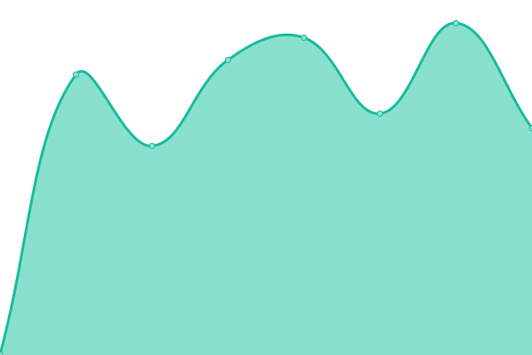
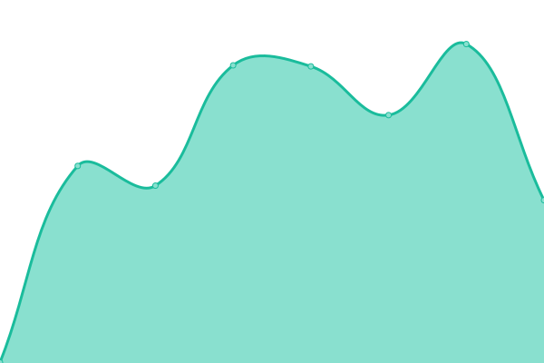

# [📈 Live Status](https://droneamplified.com): <!--live status--> **🟧 Partial outage**

This repository contains the open-source uptime monitor and status page for [pfletche](https://droneamplified.com), powered by [Upptime](https://github.com/upptime/upptime).

With [Upptime](https://upptime.js.org), you can get your own unlimited and free uptime monitor and status page, powered entirely by a GitHub repository. We use [Issues](https://github.com/pfletche/da-web-uptime/issues) as incident reports, [Actions](https://github.com/pfletche/da-web-uptime/actions) as uptime monitors, and [Pages](https://droneamplified.com) for the status page.

<!--start: status pages-->
<!-- This summary is generated by Upptime (https://github.com/upptime/upptime) -->
<!-- Do not edit this manually, your changes will be overwritten -->
<!-- prettier-ignore -->
| URL | Status | History | Response Time | Uptime |
| --- | ------ | ------- | ------------- | ------ |
|  [DA Website (lightdail)](https://droneamplified.com) | 🟩 Up | [da-website-lightdail.yml](https://github.com/pfletche/da-web-uptime/commits/HEAD/history/da-website-lightdail.yml) | 

 731ms
     
 | 

<a href="https://pfletche.github.io/da-web-uptime/history/da-website-lightdail">100.00%</a>
    

|  [DA Dev Site (lightsail)](https://droneamplified-dev.com) | 🟥 Down | [da-dev-site-lightsail.yml](https://github.com/pfletche/da-web-uptime/commits/HEAD/history/da-dev-site-lightsail.yml) | 

 0ms
     
 | 

<a href="https://pfletche.github.io/da-web-uptime/history/da-dev-site-lightsail">0.00%</a>
    

|  [DA New Website (lightsail)](http://3.133.149.189/) | 🟩 Up | [da-new-website-lightsail.yml](https://github.com/pfletche/da-web-uptime/commits/HEAD/history/da-new-website-lightsail.yml) | 

 253ms
     
 | 

<a href="https://pfletche.github.io/da-web-uptime/history/da-new-website-lightsail">100.00%</a>
    

|  [D.A. Guide](https://guide.droneamplified.com/) | 🟩 Up | [d-a-guide.yml](https://github.com/pfletche/da-web-uptime/commits/HEAD/history/d-a-guide.yml) | 

 298ms
     
 | 

<a href="https://pfletche.github.io/da-web-uptime/history/d-a-guide">100.00%</a>
    

<!--end: status pages-->

[**Visit our status website →**](https://droneamplified.com)

## 📄 License

- Powered by: [Upptime](https://github.com/upptime/upptime)
- Code: [MIT](./LICENSE) © [pfletche](https://droneamplified.com)
- Data in the `./history` directory: [Open Database License](https://opendatacommons.org/licenses/odbl/1-0/)
